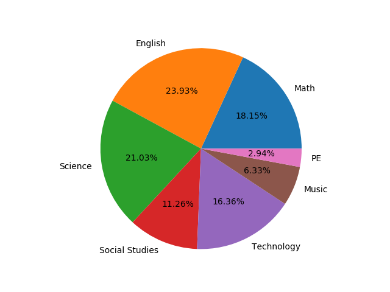
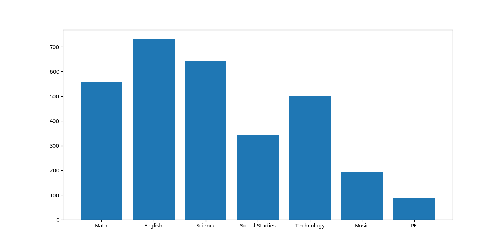

# Hardest Subjects
A group of kids were surveyed from a school and asked which were the hardest subjects. Two programs were written to analyze the data and return as visual representations
## Pie chart of the Data

## Bar chart of the Data

The second one will look better if you look at the image
> Note: This data can be reused and changed. All the data is in the .csv file